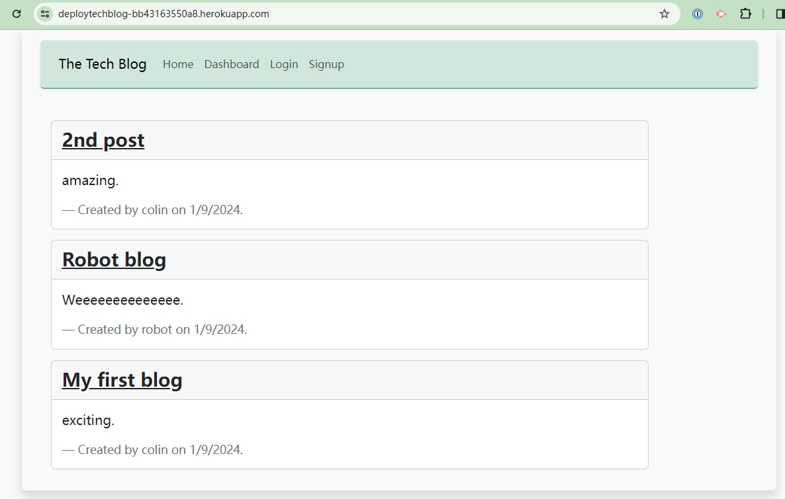
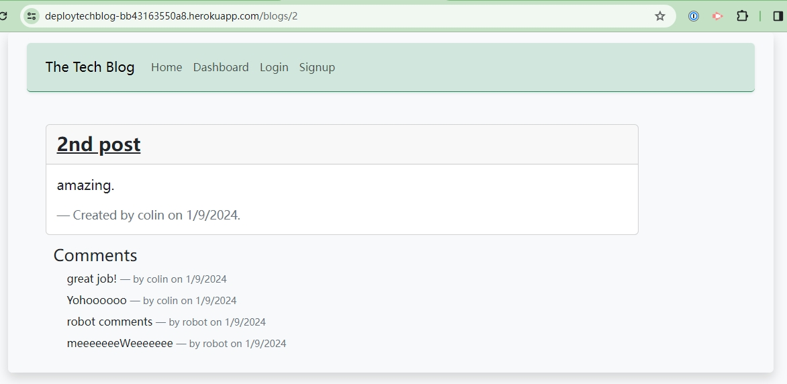
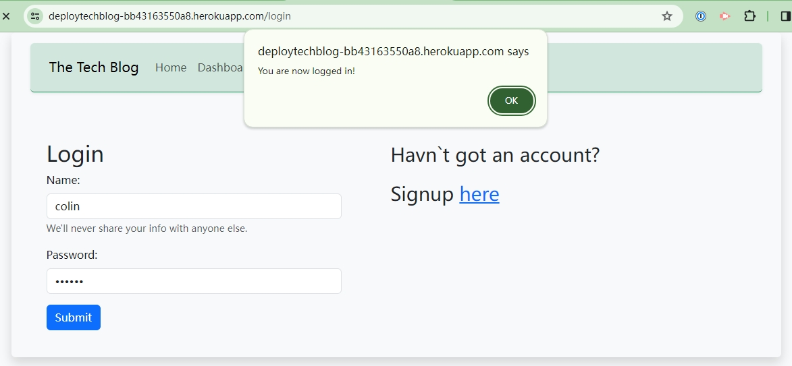
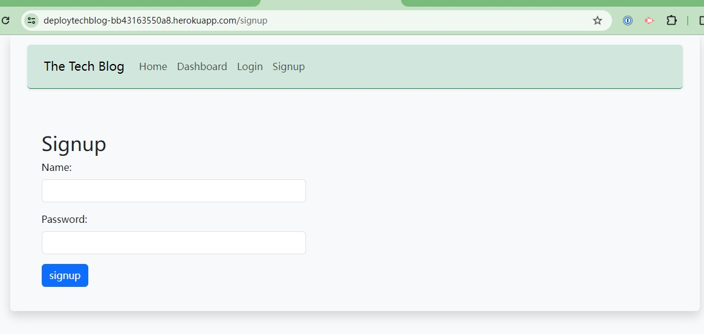
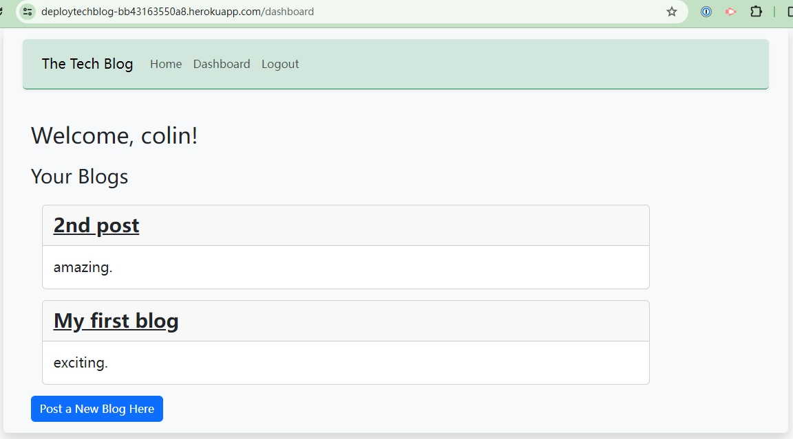
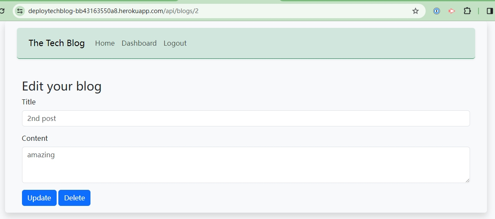
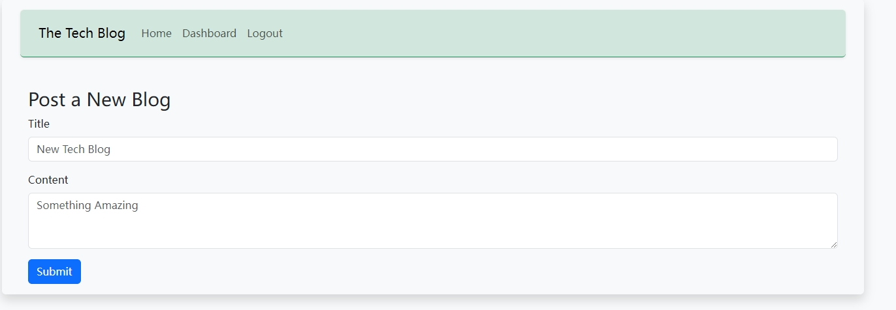
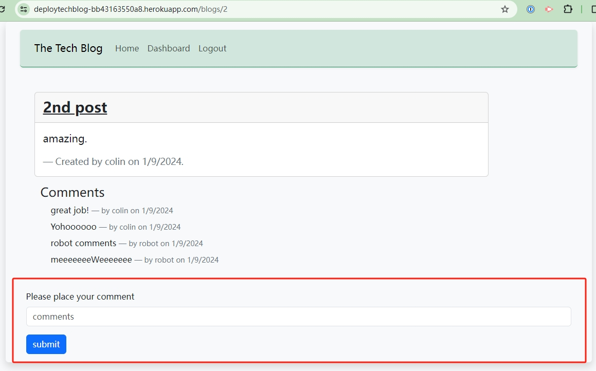

# TechBlog

## Description

a full-stack application that adapts MVC structure, achieving sessions login, posting, modifying posts, added comments on other`s posts ect functions.

## Table of Contents

- [Installation](#installation)
- [Usage](#usage)
- [License](#license)
- [Contribution](#contribution)
- [Test](#test)
- [Further Questions](#furtherquestions)

## Installation

for local installtion:

Open the directory from VS Code.

1. go to the db directory, use $mysql -u root -p  to longin, then construct the db structure $source schema.sql

2. run $npm install to install packages.

3. create .env file to addon your personal informations.

4. start the app by $npm start

for online user:
1. simply open this link to use:
https://deploytechblog-bb43163550a8.herokuapp.com

## Usage

1. without login, users can view all the posts and their comments:

  
  

2. without login, other links pointing to either login or signup:

  
  

3. when logged in, you can post, edit and delete your own post, also can comments on others post:

  
  
  
  

## License

N/A

## Contribution
You can contribute to this application by revising the codes here:  
https://github.com/mkdkck/TechBlog

## Test
N/A

## FurtherQuestions

please review the codes here：  
https://github.com/mkdkck/TechBlog

or contact the owner via: colin173@gmail.com

## Badges

